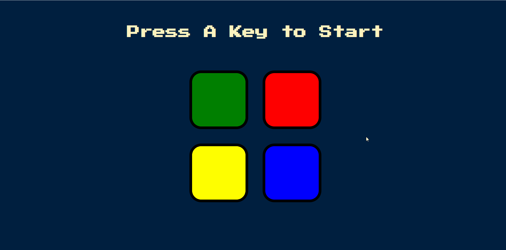

# Simon-Game-Challenge.github.io

Simon is an electronic game of memory skill invented by Ralph H. Baer and Howard J. Morrison, working for toy design firm Marvin Glass and Associates, with software programming by Lenny Cope. The device creates a series of tones and lights and requires a user to repeat the sequence.

## Link to project:
https://dans7an.github.io/Simon-Game-Challenge.github.io/

## How It's Made:
Tech used: HTML, CSS, JavaScript, & Jquery

Here is a web version of the famous Simon game, the CPU generates random numbers that are converted to a sequence of colors. A user is supposed to click on the colors that the computer respectively displays in a sequence. 
Try it out and see how far you can go

## Examples:
Take a look at some more examples of games that I have:

Rock Paper Scissors: https://dans7an.github.io/Rock-Paper-Scissors/
 
Dice game: https://dans7an.github.io/Dice-game/
